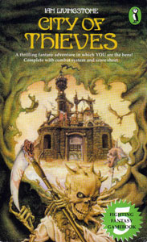
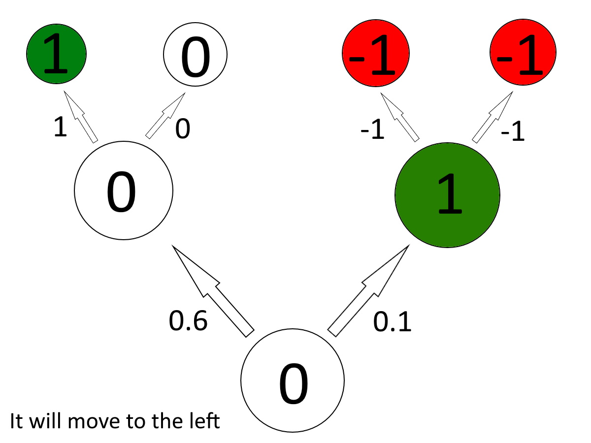
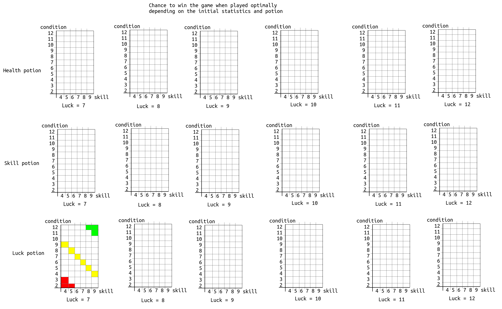
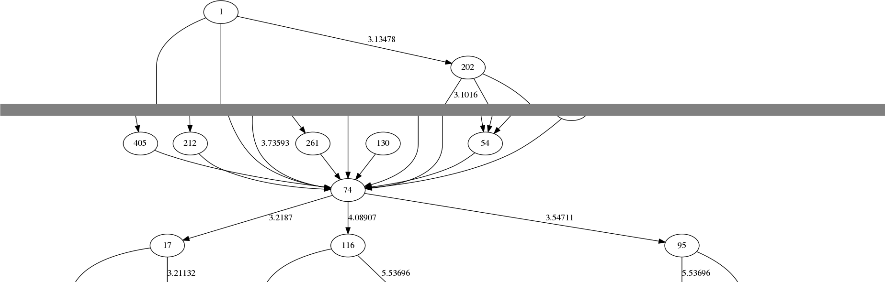

# City of Thieves solved

 * Authors: Richel J.C. Bilderbeek [1], Rafayel Gardishyan [2], Rob Krueger [2], 
   Rijk van Putten, Joshua van Waardenberg [2]

 * [1] Corresponding author
 * [2] Contributed to the work equally, sorted alphabetically on last name 

## Abstract

City of Thieves is a text adventure in the form of a book.
To beat it, a player has to make the right choices, in a stochastic environment.
The optimal strategy to beat this game is unknown.
Here we show the optimal strategy to beat this game.
[prime result here].

## Introduction

In the 1980's, before the era of computing, adventure books
allowed the reader to partake a fictional adventure.
Adventure books consisted of hundreds of short chapters in
a random order. The reader starts at chapter 1 and is asked
to do one of multiple actions. Each action takes the player
to a next chapter. The player ultimately completes the game
or dies.

> Cover of the first edition of 'City of Thieves'

City of Thieves is a an adventure book written by Ian Livingstone in 1984.
The player should venture to the castle of the protagonist,
after having visited a certain person in a medieval city,
the titular 'City of Thieves'. 

A character has three statistics: health, skill and luck. 
More health allows a player to take more damage,
for example, taking hits in combat.
More skill allows a player to be better in combat,
as well as succeed in certain situations, 
for example, [example].
More luck allows a player in a situation that requires luck,
for example, when an arrow trap springs, luck may let the player 
avoid the (lethal!) arrow.

These three statistics can be modified within the game.
Health can be increased by certain items, such as food. 
Health decreases when taking damage, which is usually in combat,
but can also stem from other physical injuries, such as falling down a wall.
Skill can be increased by certain items, such as a better sword.
Skill can be decreased by other such items, such as cursed gloves that
decrease the dexterity of the wearer.
Luck can be increased by certain events or items, 
such as hearing a blessed song.
Luck decreases mostly by using it (see below) or by certain events, such as 
killing one of the key characters.

The game starts with a character generation session, 
similar to most RPGs.
For one or more times, 4 dice are rolled.
In a pre-defined order, the dice values determine the
player's characteristics.
A player's skill equals the first dice roll value plus three (this 
deviates from the game, see 'Discussion'), the condition is the sum of two dice rolls,
where luck is the last dice roll value plus six.
The player may roll as often as possible, allowing to get the best values,
but this is quite dull.
According to Livingstone, the adventure is constructed in such
a way, that these dice rolls are of less importance. It is unknown,
however, if the game can be completed with the worst dice rolls.

After the character generation session, a player may pick
one of three potions, for either of the three statistics.
Where the health and skill potion refresh their respective value
to the initial value, a luck potion does so, as well as add one additional 
point. It is an open question, which potion is best to pick

At the start of the game, the player starts with [items] and [number] 
gold coins. These items may be lost or sold. 
The gold coins are used as a currency, to buy items or other situations,
such as bribing a guard.

Within the actual game, there are multiple kinds of chapters.
The most common type of chapter is to pick one of multiple
actions. Sometimes some actions can only be picked after having
acquired a certain item [example here]. The other types of chapters
are fighting chapters, logical chapters, luck chapters and skill chapters.

In a fighting chapter, the player fights one, two or three opponents.
All opponents have a know value for their health and skill, that
are similar to the player. The goal of the player, is to 
succeed in combat, by bringing down the health of opponents to zero.
Likewise, when an opponent hits the player, its health goes down,
where a health of zero ends the game. 
A player can use luck to increase the damage dealt to the enemy,
or to decrease the damage dealth by that enemy. Using luck decreases its
value, decreasing the change of a positive event in successive usages. 

A logical chapter is simply a conditional statement
regarding the possession of an item. For example, when the
player leaves the city, he/she needs to possess some key items,
else the game is over.

Luck and skill chapters are similar: a player needs to roll the dice
to test his/her skill or luck, after which a different chapter follows
depending the success of this. An example of a skill chapter is [example].
An example of a luck chapter is [example]. The only additional difference
is that using luck decrease that statistic.

The adventure starts at the gates of the city, the first city
streets, a bridge at which a vital character lives, some more city streets,
after which the city is left. If the player has acquired some esstial items,
the adventure goes through a forest, followed by the keep of the protagonist.
The story always go forwards, that is each location can only be visited once,
as the player cannot venture back.
There is only location (the keep's 2nd and 3rd [check] floor) in which
a location can be visited multiple times, but doing so is either
neutral or detrimental.

Because the player cannot go back and the player needs to acquire some
essential items, some decisions cause the player to lose the game due to
this. For example, at the first junction after crossing the bridge,
the player must go towards the [name] street to acquire such a key item,
after which the game takes the player back to follow the other street 
afterwards. Therefore, reaching the latter location on itself is uninformative:
only with the key item acquired the player has a change of winning the game.
The state transition, however, is informative: going from that 
junction directly to the final destination (without getting the
key item) is a sure fail.

Upon passing the city gate, there is junction, in which the player
has to choose one of three streets. None of these streets contain an
essential item and all lead to the same bridge. Yet, these three routes
vary in the items a player can find as well as the amount of danger.
It is unknown which of these three streets results in the
highest chance of success.

This research answers all the questions a player of 'City of Thieves'
may have, solving one more puzzle that has plagued humanity for decades.

## Hypotheses

 * H_0: the dice rolls at the start of the game do not influence the
   chance of winning the game, when the game is played optimally
 * H_1: the potion picked at the start of the game do not influence the
   chance of winning the game, when the game is played optimally
 * H_2: it does not matter which of the three streets is picked at the initial
   junction for the chance of winning the game, when the game is played optimally

## Methods

To allow the game to be solved by a computer, it has been converted
to a computer game. 

We used [a] technique to answer the hypotheses.

We picked this technique, because [...]

Assigning pay-off values to certain location is expected to fail,
as only a location is uninformative. For example, one can reach a certain
location by taking a short-cut, yet without acquiring an essential item. 

Assigning pay-off values to certain choices is expected to be more 
viable, as this will allow an algorithm to take a detour to obtain
a vital item.

To answer H_0 and H_1, we measure the change to win the game, when played
optimally, for the different initial statistics and potion. If all chances
are all equal, H_0 and H_1 is accepted. If chances differ between the
different statistics, H0 is rejected. If chances are all identical, yet
differ per initial potion, H_1 is rejected.

To answer H_2, we measure the payoff the optimal stategy assigns to
either of the three streets. If these payoffs are equal, H_2 is accepted,
else H2 is rejected.

### Rob's idea, Q-Learning:

Q-learning works with rewards, so you can get a reward for acquiring a good 
item or for completing the game. For every state, the chapter and all
the items in this case, it gives a certain value to every possible action. 
It isn't 'short-sighted', so it won't do a certain action if that action gives 
him a reward but there aren't any good moves afterwards. 

It does this because of a special formula:

The rewards are values between -1 and 1. The tricky part is assigning the rewards. 
What do you define as a good move? 
I think the reward should be a small negative reward if the action didn't 
result in a condition loss, but also not resulted in acquiring a good item. 
This will prevent it for walking in a loop. If a action resulted in a condition 
loss, then it should get a slightly bigger negative reward. For losing the game, 
the reward is obviously -1. For winning the game, the reward is 1. Acquiring a 
vital item results in a reward of 0.5-0.6. Acquiring a regular item results in a
small reward of 0.2.

[RJCB: that's a good first start! As you already mentioned, one needs to define
the rewards. There are multiple rational ways to do so, just pick one and 
describe it well. AFAIK, the scale does not matter much. For the lower value,
maybe it is logical to assign zero to a game over, 
as the chance of winning the game there is zero.
As of items: vital items should have a very high reward, as without them,
the game is lost for sure. For regular items: some items are good (e.g. a
pair of magic boots), some are
neutral (the knucklebones, they do nothing) and some are even bad (e.g.
a cursed glove).
The game has no loops, except for one in the tower. Because the questions are
about optimal play, we can forbid the AI to go looping :-)]

### Rafayel's idea: Multi-run

As we already know, Richel has an algorithm which can give scores to nodes based by their chance to lead to a win state. This algorithm is nog very effective though. The solution I think would work is to run that same algorithm for a little longer (approximately 10 to 20 times win state) and based on the results elliminate the "zero-chance" nodes for the next algorithm which then will run trough the game but not from top to bottom but otherwise. So you begin with the win state and trace your way back. This way you have to check less nodes and the process will go faster.
In the end we would have a graph with the best working routes.

## Results

> Figure 1: the chance to win the game when played optimally,
> for the different initial statistics
> and initial potion.
> Colors denote this chance, from red (0%) to green (100%) [let the
> plotting algorithm decide]

As can be seen in figure 1, there are different probabilies to win
the game regarding the initial dice rolls. Therefore, H_0 is rejected.
Instead, [interpret]

As can be seen in figure 1, there are different probabilies to win
the game regarding the initial choice of potion. Therefore, H_1 is rejected.
Instead, picking a [some] potions gives the highest chance of success.

> Figure 2: graph of the game, in which the nodes are the chapters,
> and edges denotes the possible actions. The number within the node
> denotes the chapter number as used in the book. The value next to each
> edge denotes the expected payoff. Node 1 is the starting chapter,
> where node 74 is the focal junction. The transitions between nodes 1 and
> 74 are summarized by a grey rectangle. Target nodes are [?] Street (17), 
> [?] Street (116) and [?] Street (95).

As can bee seen in figure 2, our algorithm assigned different 
payoffs going from the junction (74) to [location] (114). Therefore, H_2 
is reject. Instead, selecting to go to [location] is part of the optimal 
strategy.

## Conclusions

## Discussions

There are some minor deviations from the book:

In the character generation, a player's skill equals the first dice roll value 
plus three, where in the book, one is allowed to add six to the dice roll 
instead. This difference is due to consistency and results in the
same behavior: the book ignores that the initial armor and sword of the
player are already accounting for three skill points. These values are
known because in chapter [?] the starting armor is lost (2 skill points)
and in chapter [?] the starting sword is lost (1 skill point). 

Chapter 130 has a fight that has a maximum number of rounds.
In the current implementation of the game, this fight has
an indefinite number of possible rounds, similar to any regular fight.
Because the optimal strategy avoids this fight, we expect this has no
consequence on our conclusions.

## Acknowledgements

RJCB was the main writer of the manuscript.
RJCB rewrote the book as a text adventure.
RG, RK, RvP, ... wrote the code for the 'Methods' section.
RJCB co-authored the 'Methods' and 'Conclusion' section with RG, RK and RvP.

## Images

Cover of the first edition, featuring art by Iain McCaig, 
from [https://en.wikipedia.org/wiki/File:Ff5puffin.jpg](https://en.wikipedia.org/wiki/File:Ff5puffin.jpg)

## References

 * [Giddings, 2006] Giddings, Seth. Walkthrough: Videogames and technocultural form. Diss. University of the West of England, Bristol, 2006.
 * [Livingstone, 1984] Livingstone, Ian. City of Thieves. No. 5. Dell Pub Co, 1984.

