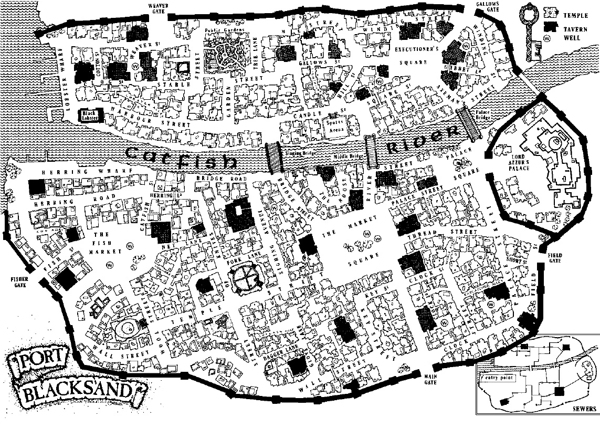
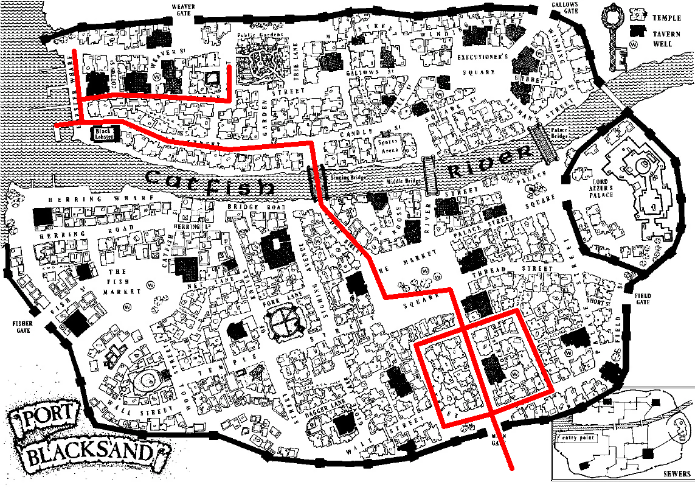

# Misc

## Items

Name                          |Description
------------------------------|--------------------------------
black_pearls                  |:heavy_exclamation_mark: Essential item 
carralifs_sword               |Initial sword
chainmail_coat                |Adds 2 skill point
climbing_rope                 |Avoidable use
coloured_candle               |Useless
copper_scorpion_brooch        |Useless
cursed_white_silk_glove       |Harmful 
dexterity_potion              |One of the three initial potions
eye_patch                     |Useless
garlic                        |Avoidable use
glass_ball                    |Useless
golden_owl                    |Avoidable use
golden_scorpion_brooch        |Adds 2 luck
gold_flower                   |Unsure: costs money and a fight, gives 10 gold
hags_hair                     |Essential item 
invisibility_ring             |Useless
iron_key                      |Unsure: can lift goblet B for 12 gold, may get magnificent shield and 1 luck and 25 gold
iron_spike                    |Useless
ivory_skull_on_a_silver_chain |Avoidable use
knucklebones                  |Useless
lantern                       |Useful to kill mummy
lotus_flower                  |Essential item
luck_potion                   |One of the three initial potions 
magic_elven_boots             |+1 skill
magic_helmet                  |+1 attack
magnificent_shield            |+1 attack
meat_hook                     |Useless
merchant_pass                 |Useful without cost
mirror                        |Useless
ordinary_sword                |.
piece_of_chalk                |Useless
potion_of_mind_control        |Useful to kill hag
ring_of_fire                  |Useful to kill mummy
ring_of_ice                   |Useless
ring_of_the_golden_eye        |Essential item
set_of_keys                   |Useless
shield                        |Initial item
shield_with_tower_crest       |Harmful: -1 skill
shield_with_unicorn_crest     |Useful: +3 skill, +1 luck
silver_arrow                  |Essential item
silver_chalice                |Useless
silver_flute                  |Useless
silver_insect_bracelet        |Avoidable use
silver_scorpion_brooch        |Heals one condition after each battle
silver_spoon                  |Useless
skeleton_key                  |Useless 
stale_brown_bread             |Useless 
stale_white_bread             |Useless
stamina_potion                |One of the three initial potions
tattoo                        |Essential item
throwing_knife                |Avoidable use
two_gems                      |Unknown: can sell for 9 gold pieces 
two_silver_goblets            |Useless

> Map of Blacksand, the City of Thieves,
> from [https://fightingfantasy.fandom.com/wiki/Port_Blacksand](https://fightingfantasy.fandom.com/wiki/Port_Blacksand)

> Map of Blacksand, the City of Thieves,
> the routes in the game,
> adapted from [https://fightingfantasy.fandom.com/wiki/Port_Blacksand](https://fightingfantasy.fandom.com/wiki/Port_Blacksand)
