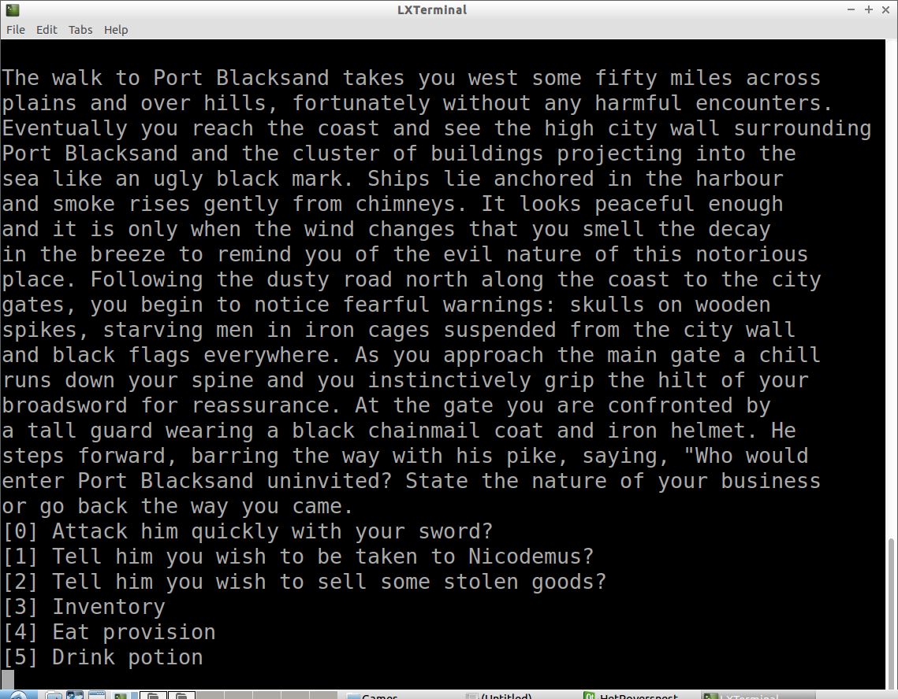
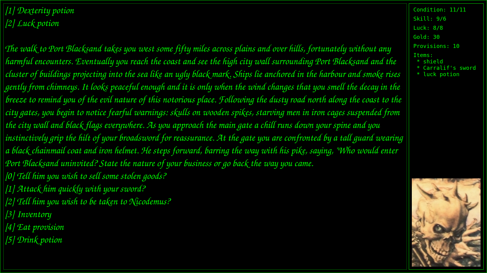
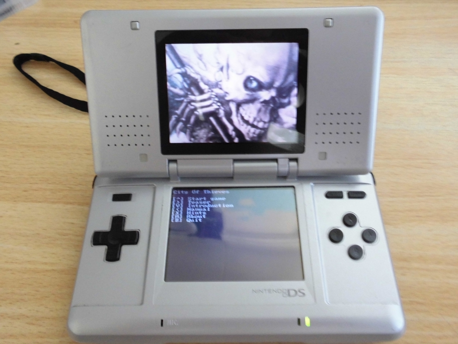
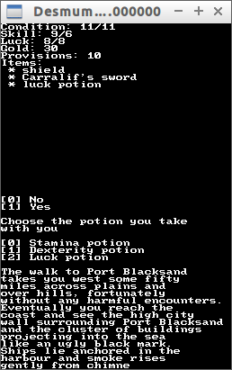

# City Of Thieves

Branch|[](https://travis-ci.org)
---|---
master|[](https://travis-ci.org/richelbilderbeek/CityOfThieves)
develop|[](https://travis-ci.org/richelbilderbeek/CityOfThieves)

City Of Thieves is a text adventure game after the English gamebook with the same name by Ian Livingstone. 

 * [Wikipedia](https://en.wikipedia.org/wiki/City_of_Thieves_%28gamebook%29)






## Downloads

 * [Windows executable](http://richelbilderbeek.nl/CityOfThievesExe.zip)
 * [NDS](http://richelbilderbeek.nl/CityOfThievesNds.zip)

## Video

 * General gameplay: [YouTube](https://youtu.be/0QeDhZQGPFo) [download (.ogv)](http://richelbilderbeek.nl/city_of_thieves.ogv)

## How to install `devkitPro` and `libnds`?

Do:

 * `sudo ./build_libnds_32`: when your computer is 32 bit
 * `sudo ./build_libnds_64`: when your computer is 64 bit

Add to `~/bashrc`:

```
export DEVKITPRO=/opt/devkitpro
export DEVKITARM=$DEVKITPRO/devkitARM
```

Restart the terminal for these exports to have an effect

Then, in the `CityOfThieves` folder:

```
./build_files
```

Then:

 * Console version: `./build_console`, then `./Console/CityOfThievesConsole`
 * Desktop version: `./build_desktop`, then `./Desktop/CityOfThievesDesktop`
 * Nintendo DS version: `./build_nds`, then `desmume ./Nds/CityOfThieves.nds`
 * Crosscompile to Windows: `./crosscompile.sh`

## I want to help!

Great!

There is need for some testing and spelling corrections. Create a new Issue or email @richelbilderbeek.

## What are all those files in the folder `Files`?

The `.txt` files contain the story of 'City Of Thieves'. 
These are converted to C++ headers and source files by the `FilesToFunctions.sh` scripts. 
This was needed, because NitroFS (as part of libnds, as part of DevKitPro) does not support a filesystem on the NDS hardware.


## External links

 * [libnds_example_1](https://github.com/richelbilderbeek/libnds_example_1): minimal NDS example
 * [libnds_example_2](https://github.com/richelbilderbeek/libnds_example_2): minimal NDS example with Madmax audio
 * [Richel Bilderbeek's games](https://github.com/richelbilderbeek/Games)
